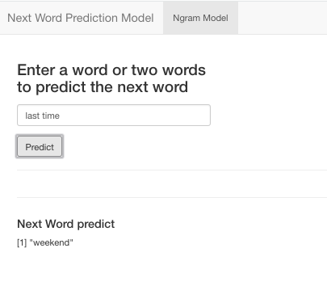

```{r setup, include=FALSE}
knitr::opts_chunk$set(echo = FALSE)
```

## Modeling

- Build a basic n-gram model for predicting the next word based on the previous 1, 2, or 3 words.

- Understand frequencies of words and word pairs

- Deploy

https://sandrarairan.shinyapps.io/proyecyo_curso_10_ngramapp/


## Description of the algorithm used to make the prediction

- These files are created

- bigrams <- grams2(ns_gram)
- write.csv(bigrams, file = "dfbigrams.csv")
- trigrams <- grams3(ns_gram)
- write.csv(trigrams, file = "dftrigrams.csv")

to use the library (tidytext) and tidyverse and separate the 
ngrams by words into columns
and create Ngram Matching Functions.

- Create Ngram Matching Functions
strsplit(x, split)
Split a character string or vector of character strings using a regular expression or a literal (fixed) string.
split – The character string to split x. If the split is an empty string (""), then x is split between every character.

## Algorithm

```{r algorithm, echo = TRUE, results='hide'}
trigram <- function(input_words){
        texto_split = strsplit(input_words, split=" ")
        trigram_columnas = data.frame(unlist(texto_split))
        l1<-length(trigram_columnas$unlist.texto_split.[1])
        l2<-length(trigram_columnas$unlist.texto_split.[2])
        
        word1<-tri_words[which(tri_words$first_word  ==trigram_columnas$unlist.texto_split.[l1-1]),]
        word2<-tri_words[which(tri_words$second_word  ==trigram_columnas$unlist.texto_split.[l2]),]
        w2 <- word2$third_word[1]
        return(w2)
      
}
```

## Give instructions, and describe how it functions

- Shiny App

´The shiny app will take a character string from user input to predict the first or second  word.
- Click on predict button, to get the next word.


***


